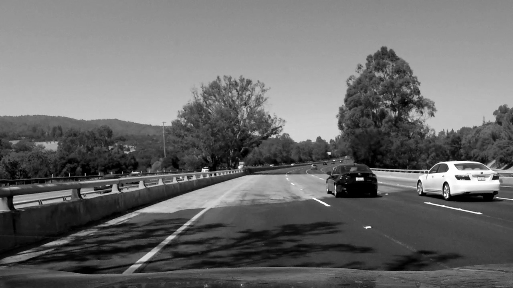
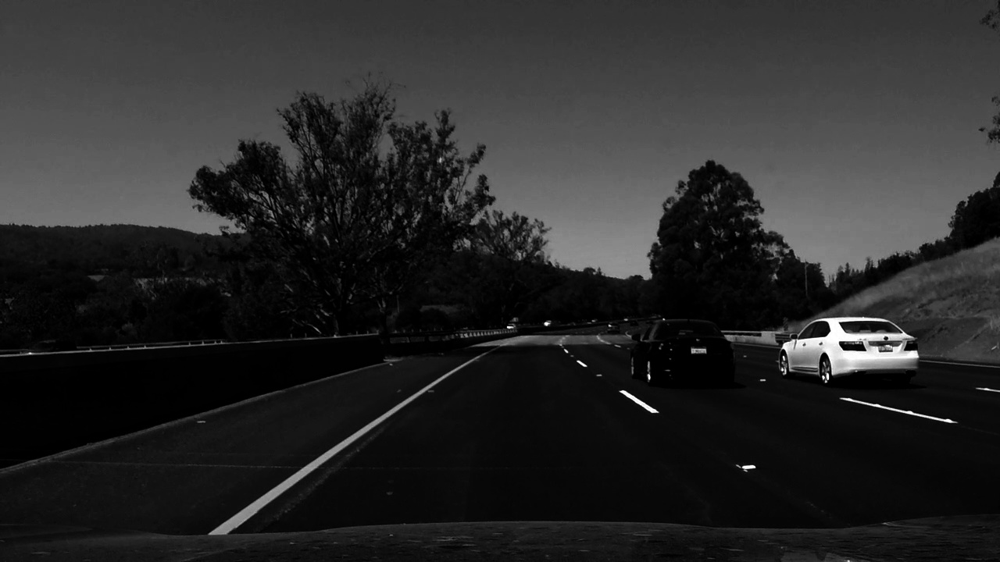
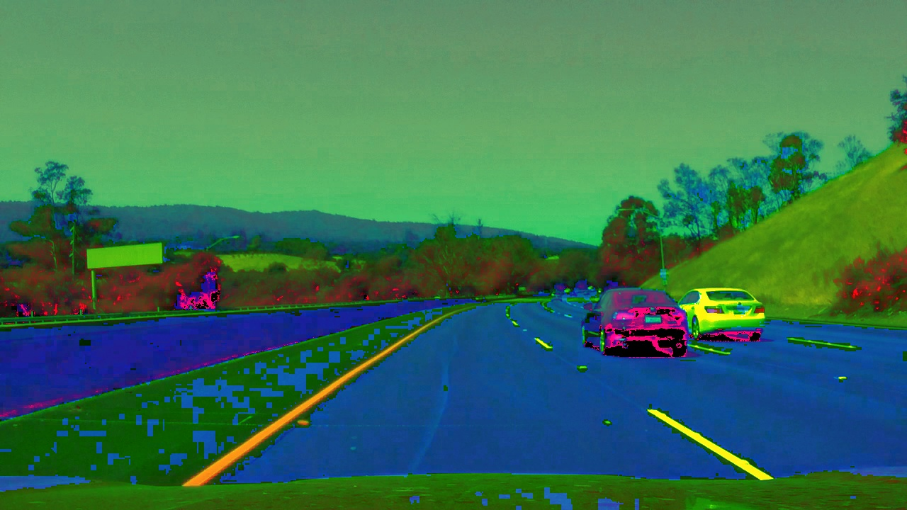
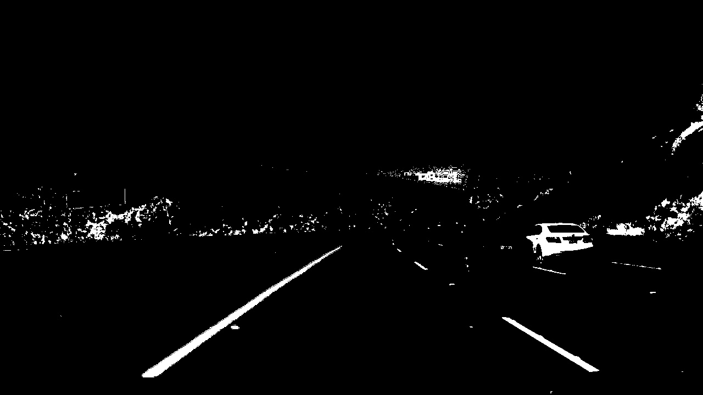
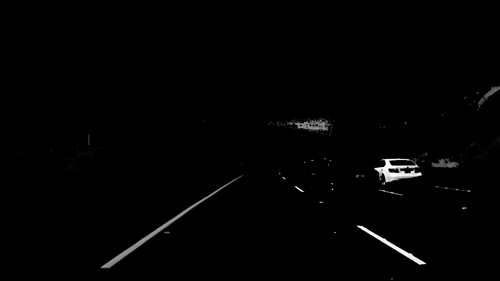
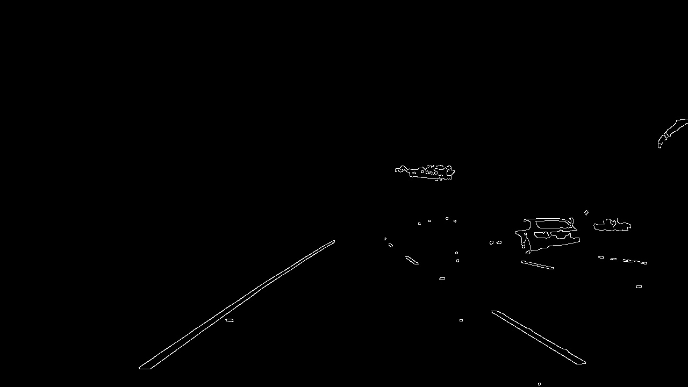
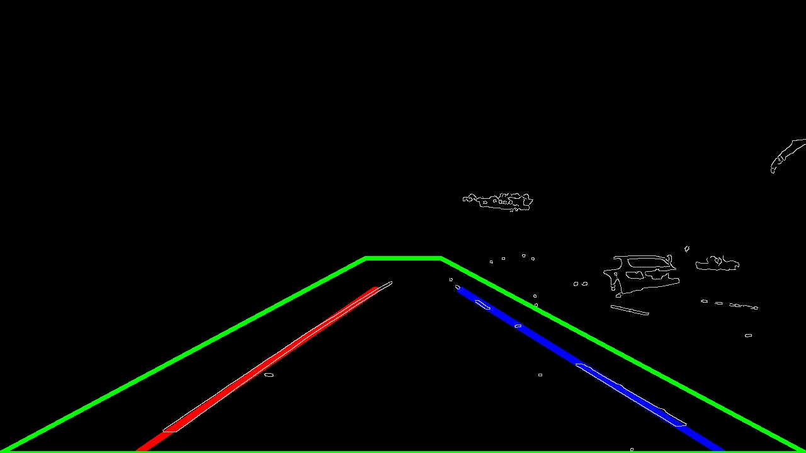
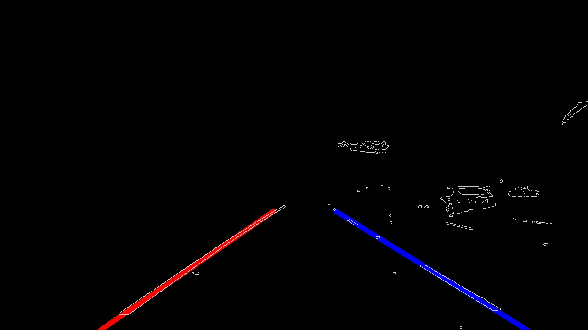

# **Finding Lane Lines**

[](http://www.udacity.com/drive)

### Usage

```
py main.py videos/video_name.mp4
```

### Project

This is the first project of Udacity's self driving car engineer nanodegree. I had to code a pipeline for detecting lane lines on road videos and images.

### Pipeline

1. Convert image to grayscale
2. Adjust the grayscale image gamma
2. Convert original image to hsl channel space
3. Create yellow and white masks to filter the hsl image from unnecessary details
4. Apply the created mask to the gray image
5. Apply gaussian blur to facilitate the use of edge detection algorithm
6. Retrieve the image edges using canny edge detection algorithm
7. Create a region of interest (roi) mask to boil out some more unnecessary details
8. Apply Hough Transform algorithm to find lines in the image
9. Get the average slope and y-intercept of all lines all generate one single line for each lane

#### Converting the image to grayscale



```python
image = mpimg.imread("images/example.jpg")
gray = cv2.cvtColor(image, cv2.COLOR_BGR2GRAY)
```

It's easier for us to work with grayscale images because they have fewer details than color images, after converting from BGR to gray we then adjust (optional) the image gamma to facilitate the feature extraction from the image

#### After adjusting the grayscale image gamma



#### Convert original BGR image to HLS



```python
hls_image = cv2.cvtColor(image, cv2.COLOR_BGR2HLS)
```

We convert from BGR color space to HLS because we can retrieve color information more easily than in plain BGR

#### Create masks to filter out unnecessary details



```python
lower_white = np.array([0, 210, 0], dtype=np.uint8)
upper_white = np.array([210, 255, 255], dtype=np.uint8)
white_mask = cv2.inRange(hls, lower_white, upper_white)

lower_yellow = np.array([10, 0, 100], dtype=np.uint8)
upper_yellow = np.array([30, 255, 255], dtype=np.uint8)
yellow_mask = cv2.inRange(hls, lower_yellow, upper_yellow)

combined_masks = cv2.bitwise_or(white_mask, yellow_mask)
```

We try to find parts of the image which are within our white and yellow color ranges and then create a single mask using OpenCV bitwise_or function

#### Apply the created mask to our gray image



```python
masked_image = cv2.bitwise_and(gray, combined_masks)
```
#### Apply Gaussian Blur


```python
kernel_size = 5
blur = cv2.GaussianBlur(masked_image, (kernel_size, kernel_size), 0)
```

[Gaussian Blur](https://en.wikipedia.org/wiki/Gaussian_blur#:~:text=In%20image%20processing%2C%20a%20Gaussian,image%20noise%20and%20reduce%20detail) is a widely used effect in computer graphics to reduce the image noise and detail, after running our image through the OpenCV GaussianBlur function the output is a smoothed image that we need to feed the edge detection algorithm. This function receives 3 parameters, the image, kernel_size and the standard deviation

#### Canny Edge Detection



There are a handful of edge detection algorithms out there, [Canny](https://en.wikipedia.org/wiki/Canny_edge_detector#:~:text=The%20Canny%20edge%20detector%20is,explaining%20why%20the%20technique%20works.) does it based on gradient changes. It is important to notice that Canny also applies blurring in the beginning of the function, but we apply Gaussian Blur to smooth even more before detecting the edges

### Region of Interest masking



```python
mask = np.zeros_like(edges)

ysize = edges.shape[0]
xsize = edges.shape[1]

left_bottom = (0, ysize)
left_top = (xsize / 2 - 60, ysize / 2 + 50)

right_bottom = (xsize, ysize)
right_top = (xsize / 2 + 60, ysize / 2 + 50)

vertices = np.array(
    [[left_bottom, left_top, right_top, right_bottom]],
    dtype=np.int32
)

cv2.fillPoly(mask, vertices, 255)
masked_image = cv2.bitwise_and(mask, image)
```

Here we are first creating an blank image to use as our mask, the next step is to define the boundaries of the region we are considering, I used both bottom extremes and a slightly separated space on the top to form a polygon as you can see above, then we just need to return our masked image with cv2.bitwise_and()

### Hough Transform



```python
rho = 2
theta = np.pi / 180
threshold = 15
starting_lines = np.array([])
min_line_length = 30
max_line_gap = 120

lines = cv2.HoughLinesP(masked_image, rho, theta, threshold, starting_lines, 
                        min_line_length, max_line_gap)
```

Now we have everything we need to find the lane lines, the demarcated area is taking most of the space where the lane lines possibly are and we boiled out most of the unnecessary details. All that is left is use the hough transform lines detection algorithm to detect some line segments and average these lines to a single line in both sides.

It is important to notice that OpenCV function HoughLinesP receives a big number of parameters and we need to pay attention to those values to have a acceptable result.

### Diving lane lines and transforming both into a single line

<p align="center">
    
</p>

This was by far the hardest part of the project, at first I tried taking the simple average of both slope and y-intercept of all lane lines, but the result was totally different from what I was expecting, the other solution was to take the weighted average of both, having fixed y values it was easy to find the x coordinates and form a single line

